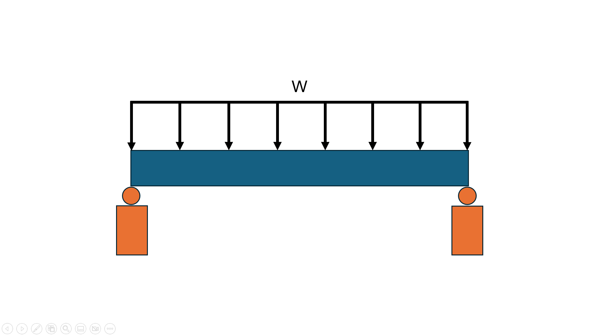

# BeamLoadCalculator

This repository contains an Octave/MATLAB program designed to analyze simply supported beams with a rectangular cross-section under a uniformly distributed load, W as shown in [[Figure 1](#figure1)]. The program calculates the load that causes yield and plastic collapse at the critical section of the beam. 

---
<a name="figure1"></a> 

Below is the table of contents for navigating the repository.

## Table of Contents
| File                                                   | Function                                               |
|--------------------------------------------------------|--------------------------------------------------------|
| [How to Run](README.md#how-to-run)                     | Instructions to execute the program                    |
| [Detailed Explanation](README.md#detailed-explanation) | Detailed explanation of the program                    |
| [Theoretical Aspects](Theoretical_aspects.md)          | Explains the theoretical framework and formulas        |
| [Programming Flowchart](Figure2.png)                   | Visual representation of the program's logic           |
| [Sample Runs](Figure3.png)                             | Screenshots of sample program outputs                  |
| [Handwritten Solutions](docs/)                         | Step-by-step solutions to a sample problem             |
| [Source Code](Code.m)                                  | Program written in Octave                              |
| [Program Workflow](Figure2.png)                        | Flowchart showing the program’s logic                  |
| [Input Window Screenshot](input_window.png)            | Example of the program’s input interface               |
| [Output Window Screenshot](output_window.png)          | Sample output generated by the program                 |


## How to Run

1. **Install Octave**:
   - Ensure you have Octave installed on your system. You can download it [here](https://www.gnu.org/software/octave/download.html).

2. **Download the Program**:
   - Clone this repository using:
     ```
     git clone https://github.com/tkjgary/BeamLoadCalculator.git
     ```
   - Alternatively, download the source files directly.

3. **Open the Program**:
   - Launch Octave.
   - Navigate to the directory containing the `Code.m` file.

4. **Run the Program**:
   - In the Octave command window, type:
     ```
     Code
     ```
     and press **Enter**.

5. **Input Parameters**:
   - Enter the required parameters one by one as prompted by the program (e.g., beam length, width, height, material properties).
   - Example:
     ```
     Modulus of elasticity, E (Pa): 200e+9
     Yield strength, Sy (Pa): 250e+6
     Width of the cross section, b (m): 250e-3
     ...
     ```

6. **View Results**:
   - Once all parameters are entered, the program will display the results, including:
     - The location of the critical section measured from the left side of the beam, Lmax (m)
     - The maximum moment of the critical section in terms of w, Mc (Nm)
     - The yield moment, My (Nm)
     - 


## Detailed Explanation
This is a project regarding simply supported beams with a rectangular cross section subjected 
to uniformly distributed load. The objective of this project is to create a program that can be 
used to calculate the uniformly distributed load that causes yield and plastic collapse at the 
critical section of the beam.

The project is only applicable for:
1. Beam materials where its normal strain distribution at the cross section varies linearly from zero at neutral axis and 
maximum at the furthest point from the neutral axis.
2. The stress-strain diagram of the material should be the same for both tension and compression.

It is assumed that:
1. The material of the beam exhibit elastic perfectly plastic behaviour when the stress in the material reaches yield stress. 

The program can be used to determine the maximum uniformly distributed load that 
can be applied on supporting beams or building frames where the material, cross section and 
length is specified. It can also be used to calculate the minimum requirements for different 
parameters to support a structure with a known load, which in turn saves costs and reduces 
wastage.  


